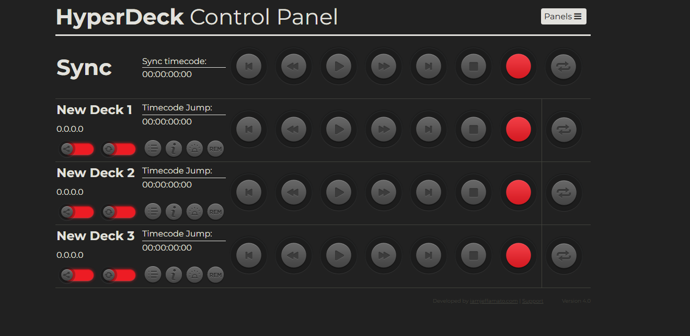

<h1 align="center"> HyperDeck 4.0 in Docker </h1>
<h4 align="center">Deck control is developed and written by <a href="https://iamjeffamato.com">Jeff Amato</a><br>
The Hyperdeck is a registered trademark of Blackmagic Design Pty Ltd</h4>

<p align="center">
<a href="https://www.php.net/releases/7_4_29.php"></a>
<a href="https://hyperdeckpanel.com"></a>
<a href="https://www.docker.com"></a>
</p>

<p align="center">
	</img>
</p>

:star: Star me on GitHub - it helps!

## Prerequisites
Install <a href="https://docs.docker.com/get-docker">Docker Desktop</a> for Mac, Windows, or Linux. Docker Desktop includes Docker Compose as part of the intallation.


##Clone and Use 

```bash
git clone https://github.com/MauricioMC28/hyperdeck-panel.git
```
This will clone the whole repository in your system.
- Now the project is ready to use
Open a terminal and place to the repository directory and launch the Deck by running the following Docker command:

```bash
docker compose up -d
```

Open <a href="http://localhost:8888">http://localhost:8888</a> with your browser to see the result<br />

Default credentials
```
Username: admin
Password: 1234
```
